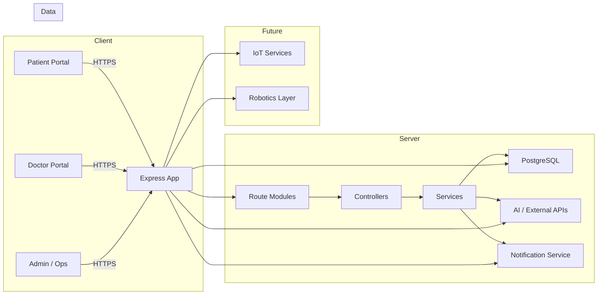

# ARTIC Health Companion Architecture

## System Architecture
ARTIC Health Companion is designed as a layered healthcare platform combining user-facing pages, server-side business logic, and a secure data tier. The architecture supports extension into AI services, notifications, IoT, and robotics.

## Backend
- Node.js and Express provide a robust, modular backend.
- Request flows are separated into route modules for user and doctor workflows.
- Controllers encapsulate business logic and integration operations.
- Shared services support database connectivity, logging, validation, and configuration.

## Frontend
- EJS templates render dynamic views on the server.
- Bootstrap and Select2 provide consistent UI elements and responsive layouts.
- Client-side scripts handle form submission, chatbot interactions, and real-time content updates.

## Database
- PostgreSQL stores user records, doctor profiles, and appointment metadata.
- The data model is intentionally simple for fast MVP delivery and future expansion.

## Authentication
- Local authentication is implemented with Passport Local strategy.
- Session management is handled by `express-session`.
- Role-aware guards protect user and doctor routes.

## AI Layer
- AI capabilities are integrated through external APIs and content scraping.
- The patient chatbot routes use a dedicated controller to relay queries.
- Disease prediction is powered by symptom analysis and external health content sources.

## Notification Service
- Future notifications are planned for appointment reminders, clinical alerts, and system messages.
- The architecture can support email, SMS, or push notification providers.

## Future IoT Layer
- The architecture reserves integration points for IoT health monitoring.
- Future services will ingest wearable data, sensor feeds, and remote vitals.

## Future Robotics Layer
- Long-term architecture includes support for healthcare robotics workflows.
- Robotics services will be integrated as orchestration layers connecting devices, EMR, and clinical decision systems.
